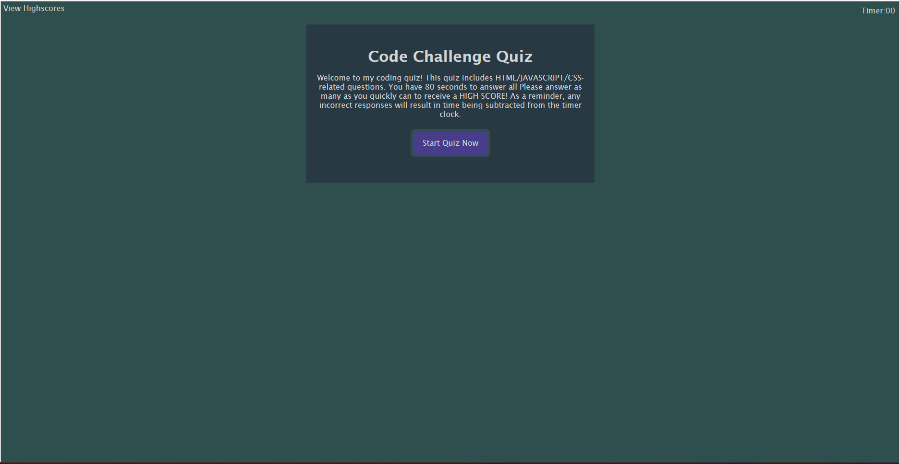

# coding-api-quiz
## Description
<H4>I created my first coding assessment quiz based on JavaScript fundamentals.</H4>
<li> Created a timed coding quiz with multiple-choice and interactive questions/challenges.</li>
<li>Applied acceptance criteria provided.</li>
<li>Created a new repository on my GitHub account and cloned it to computer.</li>
<li>Deployed project using git commands and pushed completed code to my GitHub repository.</li>

## Link To Deployed Project/Application
https://juliennejulien.github.io/coding-api-quiz/

## Visuals

